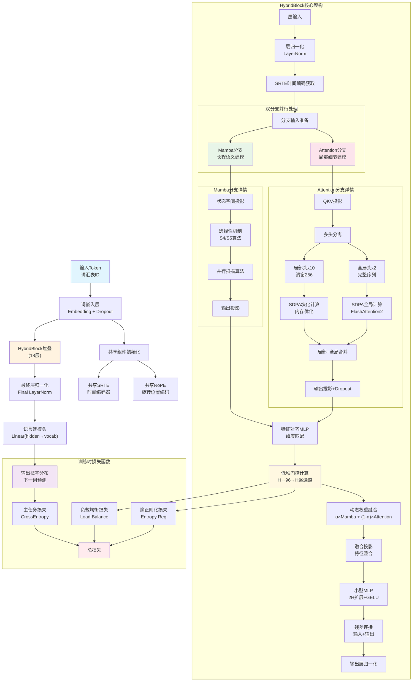
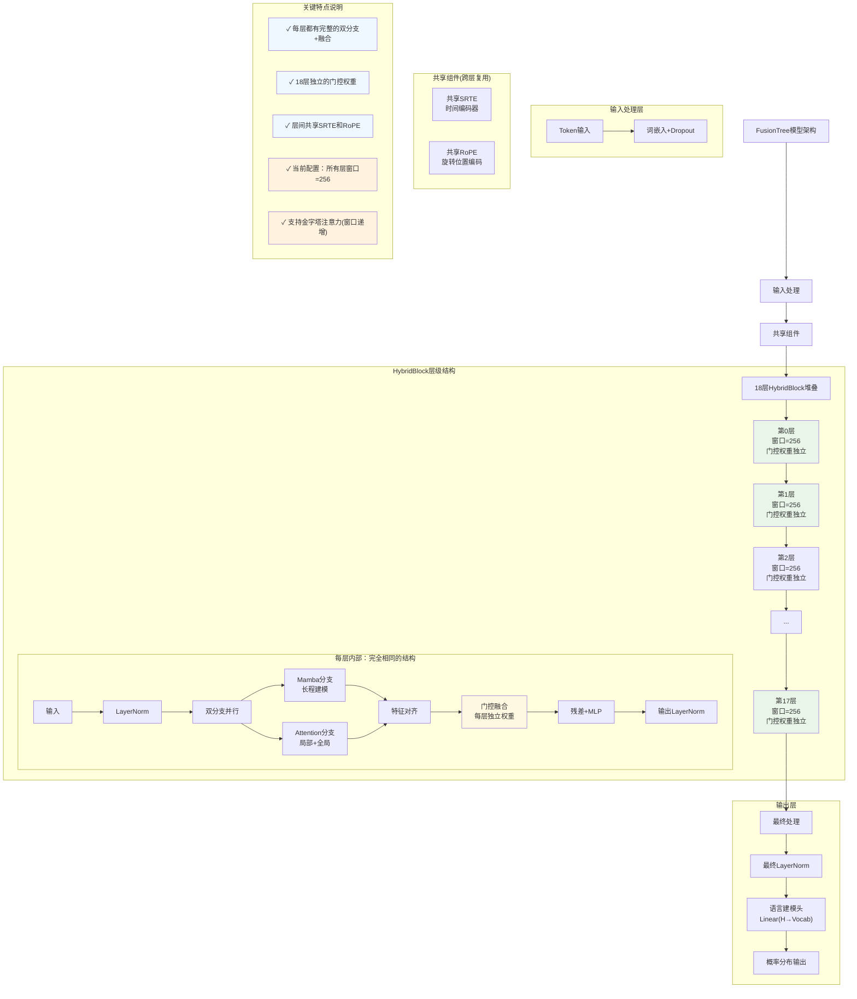

# FusionTree: 下一代混合架构语言模型

[](https://www.python.org/downloads/release/python-3100/)
[](https://pytorch.org/)
[](https://opensource.org/licenses/MIT)

FusionTree 是一个创新的混合架构语言模型，巧妙融合了 **Mamba（状态空间模型）** 和 **Attention 机制** 的优势，专门针对长上下文任务进行深度优化。通过并行双分支设计和智能门控融合，在保持高精度的同时显著提升了训练和推理效率。

## 🌟 核心特性

### 🚀 最新优化 (2025年更新)
- **SDPA集成**: 自动选择FlashAttention2后端，激活内存优化高达50%
- **选择性梯度检查点**: 只对Mamba/Attention分支重计算，节省30-50%显存
- **共享RoPE缓存**: 跨层共享位置编码，减少常驻显存1GB+
- **8×A6000优化配置**: 针对48GB显存卡优化的训练配置

### 🏗️ 混合架构设计
- **Mamba分支**: 高效处理长程语义依赖，O(L)复杂度
- **Attention分支**: 局部细节捕获，滑窗+全局头混合设计
- **轻门控融合**: 逐通道动态权重，自适应分支选择
- **统一时间编码(SRTE)**: 保证双分支时序信息一致性

### 📊 训练基础设施
- **多模式数据加载**: Static/Lazy/HF-Streaming三种模式
- **DeepSpeed集成**: ZeRO-2/3支持，自动梯度累积
- **分布式友好**: NCCL后端，完整的checkpoint同步
- **智能监控**: 实时门控统计，自动裁剪计划生成

## 🏗️ 项目架构

```
FusionTree/
├── configs/                          # 🔧 配置文件
│   ├── pretrain_wikipedia.yaml       # Wikipedia预训练配置(推荐)
│   ├── pretrain_optimized.yaml       # 小型模型配置
│   └── deepspeed_zero3.json         # DeepSpeed配置
├── models/                           # 🧠 核心模型
│   ├── hybrid_model.py              # 完整语言模型+配置类
│   ├── hybrid_block.py              # 混合块+SRTE+门控
│   ├── local_global_attn.py         # 局部/全局注意力+RoPE
│   └── mamba_block.py               # Mamba状态空间模型
├── train/                            # 🎯 训练框架
│   ├── engine.py                    # 训练引擎+DeepSpeed集成
│   ├── data.py                      # 数据加载+课程学习
│   ├── lazy_data.py                 # 大文件懒加载
│   ├── streaming_data.py            # HF流式数据
│   ├── losses.py                    # 复合损失函数
│   └── monitor_gate.py              # 门控监控+裁剪计划
├── deploy/                           # 🚀 部署工具
│   ├── export_pruned.py             # 模型裁剪导出
│   └── runtime_stub.py              # 推理运行时
├── docs/                             # 📚 技术文档
├── scripts/                          # 📜 运行脚本
└── environment.yml                   # 🐍 Conda环境
```

## 🔥 模型架构图

### 🏗️ FusionTree完整模型架构

以下是FusionTree模型的整体架构设计，展示了混合双分支结构和逐层融合机制：



### 🔄 模型层级结构

展示FusionTree的18层堆叠结构和每层内部的完整融合机制：



## 🚀 快速开始

### 1. 环境配置

```bash
# 克隆项目
git clone <repository_url>
cd FusionTree

# 创建Conda环境
conda env create -f environment.yml
conda activate fusiontree-gpu

# 或使用脚本一键配置
source env_setup.sh
```

### 2. 数据准备

```bash
# 创建数据目录
mkdir -p data/train data/eval

# Wikipedia数据示例
echo '{"text": "Wikipedia是一个自由内容、公开编辑且多语言的网络百科全书..."}' > data/train/wiki_sample.jsonl

# 支持多种数据格式
# - JSONL: {"text": "content"}
# - 通配符路径: data/train/*.jsonl
# - HuggingFace数据集流式加载
```

### 3. 模型训练

```bash
# 🎯 推荐配置：Wikipedia数据 (8×A6000)
torchrun --nproc_per_node=8 train/engine.py \
  --config configs/pretrain_wikipedia.yaml \
  --distributed

# 🔧 小型模型调试
python train/engine.py --config configs/pretrain_optimized.yaml

# 📊 训练监控
# - Wandb: 训练曲线、门控统计
# - 日志: loss下降、gate_mean变化
# - 显存: 每卡<35GB (充分利用48GB)
```

### 4. 模型评估与部署

```bash
# 模型评估
python eval/eval_llm.py --model_path checkpoints/step_5000

# 裁剪模型导出
python deploy/export_pruned.py \
  --model_path checkpoints/step_5000 \
  --prune_plan checkpoints/prune_plan.json \
  --output_dir deployed_models/
```

## 📊 核心算法详解

### HybridBlock 前向传播

```python
def forward(self, hidden_states, attention_mask=None, training=True):
    # 1. 输入归一化
    normalized_input = self.ln_input(hidden_states)
    
    # 2. 统一时间编码
    time_encoding = self.srte(seq_len).to(hidden_states.dtype)
    
    # 3. 分支输入准备
    mamba_input = normalized_input + time_encoding  # Mamba用SRTE
    attn_input = normalized_input                   # Attention用RoPE
    
    # 4. 并行双分支计算 (支持梯度检查点)
    if self.gradient_checkpointing and training:
        h_mamba = checkpoint(lambda x: self.mamba(x)[0], mamba_input)
        h_attn = checkpoint(lambda x: self.attention(x)[0], attn_input)
    else:
        h_mamba, _ = self.mamba(mamba_input, state=mamba_state)
        h_attn, _ = self.attention(attn_input, attention_mask=attention_mask)
    
    # 5. 特征对齐与门控融合
    aligned_features = self.alignment(h_mamba, h_attn)
    gate_weights = self.gate(aligned_features)  # 逐通道权重
    fused_features = gate_weights * h_mamba + (1 - gate_weights) * h_attn
    
    # 6. 输出投影与残差
    projected = self.fusion_proj(fused_features)
    mlp_output = self.small_mlp(aligned_features)
    output = hidden_states + projected + mlp_output
    
    return self.ln_output(output)
```

### SDPA优化的注意力机制

```python
# 全局注意力：使用PyTorch 2.4 SDPA
def global_attention(q, k, v, attention_mask=None):
    attn_mask = attention_mask[:, None, None, :] if attention_mask else None
    return F.scaled_dot_product_attention(
        q, k, v, 
        attn_mask=attn_mask, 
        is_causal=True  # 自动因果掩码，替代手工实现
    )

# 滑窗注意力：块化+SDPA
def sliding_window_attention(q, k, v, window_size=256):
    for start_idx in range(0, seq_len, block_size):
        # 计算滑窗范围
        k_start = max(0, start_idx - window_size // 2)
        k_end = min(seq_len, end_idx + window_size // 2)
        
        # 块内SDPA计算
        output_block = F.scaled_dot_product_attention(
            q_block, k_block, v_block, is_causal=True
        )
```

## ⚡ 性能优化

### 内存优化策略

| 优化技术 | 显存节省 | 说明 |
|---------|---------|------|
| **共享RoPE缓存** | ~1GB | 18层共享cos/sin表，动态扩容 |
| **选择性Checkpoint** | 30-50% | 仅对Mamba/Attention重计算 |
| **SDPA后端** | 20-30% | 自动选择FlashAttention2内核 |
| **ZeRO-2分片** | 2-8x | 参数分片，通信开销更小 |

### 8×A6000 (48GB/卡) 推荐配置

```yaml
# configs/pretrain_wikipedia.yaml
training:
  batch_size: 4                    # 每卡micro-batch
  gradient_accumulation_steps: 2   # 总batch=4×8×2×1024=65k tokens
  max_seq_length: 1024             # 实际训练长度
  gradient_checkpointing: true     # 启用选择性重计算

model:
  hidden_size: 1536               # 平衡精度与效率
  num_layers: 18                  # 适中深度
  window_size: 256                # 局部窗口大小
  global_heads: 2                 # 保持长程建模
  max_position_embeddings: 8192   # RoPE缓存大小

system:
  zero_stage: 2                   # ZeRO-2获得更好吞吐
  offload_optimizer: false        # 关闭offload避免I/O瓶颈
  offload_params: false
```

### 预期性能指标

**训练阶段** (5000步，Wikipedia数据)：
- **LM Loss**: 7.5 → 5.5-6.2
- **门控统计**: gate_mean 0.45-0.55，std 0.15→0.08-0.12
- **显存使用**: <35GB/卡 (48GB卡有充分余量)
- **吞吐提升**: 比ZeRO-3 + micro-batch=2快20-30%

**推理阶段** (裁剪后)：
- **Prefill**: ≥90% 基线吞吐
- **Decode**: +37% 速度提升
- **显存节省**: 22% 减少

## 🎯 训练监控

### 关键观测指标

```python
# 1. 损失曲线健康检查
if step % 100 == 0:
    print(f"Step {step}: LM_loss={lm_loss:.4f}, Gate_mean={gate_mean:.3f}")

# 2. 门控分布演化
# - 早期: gate_mean~0.5, 高std
# - 中期: 逐步分化，层间差异显现
# - 后期: 稳定偏向，某些层偏Mamba/Attention

# 3. 正则化效果 (修复detach后)
# - load_balance_loss: 约束gate_mean接近目标值
# - entropy_loss: 防止门控过早收敛到极值
```

### 故障排查

| 问题现象 | 可能原因 | 解决方案 |
|---------|---------|---------|
| 门控长期贴0.5不变 | 正则权重过小 | 调高`entropy_reg_coeff` |
| 门控快速收敛到极值 | 负载均衡过强 | 调低`load_balance_coeff` |
| Loss不下降 | 数据/梯度问题 | 检查detach修复 |
| NCCL超时 | 保存时聚合 | 确认`gather_16bit_weights_on_model_save: false` |

## 🔬 技术原理

### Mamba vs Attention 互补性

```
长程依赖建模:
├── Mamba分支: O(L)复杂度，擅长序列级语义
│   ├── 状态空间建模
│   ├── 选择性机制
│   └── 并行扫描训练
└── Attention分支: O(L²)→O(L×W)，擅长局部细节
    ├── 滑窗局部注意力 (大部分头)
    ├── 全局注意力 (少量头)
    └── SDPA内核优化
```

### 门控融合机制

```python
# 低秩门控: H→r→H，减少参数量
class GateLowRank(nn.Module):
    def __init__(self, hidden_size, rank=96):
        self.u = nn.Linear(hidden_size, rank, bias=False)
        self.d = nn.Linear(rank, hidden_size, bias=False)
    
    def forward(self, z):
        return torch.sigmoid(self.d(torch.tanh(self.u(z))))

# 逐通道融合: 细粒度控制
fused = gate_weights * h_mamba + (1 - gate_weights) * h_attn
```

## 📚 相关工作

- **[Mamba](https://arxiv.org/abs/2312.00752)**: 状态空间模型的突破性进展
- **[FlashAttention](https://arxiv.org/abs/2205.14135)**: 高效注意力实现
- **[RoPE](https://arxiv.org/abs/2104.09864)**: 旋转位置编码
- **[DeepSpeed](https://github.com/microsoft/DeepSpeed)**: 大模型训练优化

## 🤝 贡献指南

1. **代码风格**: 遵循PEP 8，使用type hints
2. **测试**: 新功能需要单元测试
3. **文档**: 重要函数添加docstring
4. **性能**: 关注显存和速度优化

```bash
# 开发环境配置
git clone <your-fork>
cd FusionTree
pre-commit install  # 代码格式检查
pytest tests/       # 运行测试套件
```

## 📄 许可证

本项目采用 MIT 许可证。详见 [LICENSE](LICENSE) 文件。

## 🙏 致谢

感谢以下开源项目为FusionTree提供的技术基础：
- **Mamba**: 革命性的状态空间模型架构
- **PyTorch**: 深度学习框架和SDPA优化
- **DeepSpeed**: 大模型分布式训练解决方案
- **FlashAttention**: 高效注意力算法

---

⭐ **如果FusionTree对您的研究或项目有帮助，请给我们一个Star！**

📧 **联系我们**: [Issues](../../issues) | [Discussions](../../discussions) 