# FusionTree: 下一代混合架构语言模型

[](https://www.python.org/downloads/release/python-3100/)
[](https://pytorch.org/)
[](https://opensource.org/licenses/MIT)

FusionTree 是一个创新的混合架构语言模型，巧妙融合了 **Mamba（状态空间模型）** 和 **Attention 机制** 的优势，专门针对长上下文任务进行深度优化。通过并行双分支设计和智能门控融合，在保持高精度的同时显著提升了训练和推理效率。

## 🌟 核心特性

### 🚀 最新优化 (2025年更新)
- **SDPA集成**: 自动选择FlashAttention2后端，激活内存优化高达50%
- **选择性梯度检查点**: 只对Mamba/Attention分支重计算，节省30-50%显存
- **共享RoPE缓存**: 跨层共享位置编码，减少常驻显存1GB+
- **8×A6000优化配置**: 针对48GB显存卡优化的训练配置

### 🏗️ 混合架构设计
- **Mamba分支**: 高效处理长程语义依赖，O(L)复杂度
- **Attention分支**: 局部细节捕获，滑窗+全局头混合设计
- **轻门控融合**: 逐通道动态权重，自适应分支选择
- **统一时间编码(SRTE)**: 保证双分支时序信息一致性

### 📊 训练基础设施
- **多模式数据加载**: Static/Lazy/HF-Streaming三种模式
- **DeepSpeed集成**: ZeRO-2/3支持，自动梯度累积
- **分布式友好**: NCCL后端，完整的checkpoint同步
- **智能监控**: 实时门控统计，自动裁剪计划生成

## 🏗️ 项目架构

```
FusionTree/
├── configs/                          # 🔧 配置文件
│   ├── pretrain_wikipedia.yaml       # Wikipedia预训练配置(推荐)
│   ├── pretrain_optimized.yaml       # 小型模型配置
│   └── deepspeed_zero3.json         # DeepSpeed配置
├── models/                           # 🧠 核心模型
│   ├── hybrid_model.py              # 完整语言模型+配置类
│   ├── hybrid_block.py              # 混合块+SRTE+门控
│   ├── local_global_attn.py         # 局部/全局注意力+RoPE
│   └── mamba_block.py               # Mamba状态空间模型
├── train/                            # 🎯 训练框架
│   ├── engine.py                    # 训练引擎+DeepSpeed集成
│   ├── data.py                      # 数据加载+课程学习
│   ├── lazy_data.py                 # 大文件懒加载
│   ├── streaming_data.py            # HF流式数据
│   ├── losses.py                    # 复合损失函数
│   └── monitor_gate.py              # 门控监控+裁剪计划
├── deploy/                           # 🚀 部署工具
│   ├── export_pruned.py             # 模型裁剪导出
│   └── runtime_stub.py              # 推理运行时
├── docs/                             # 📚 技术文档
├── scripts/                          # 📜 运行脚本
└── environment.yml                   # 🐍 Conda环境
```

## 🔥 架构设计图

### 🏗️ 完整系统架构

以下是FusionTree的完整系统架构，展示从数据处理到模型部署的全流程：

```mermaid
graph TB
    subgraph "FusionTree 完整系统架构"
        subgraph "数据处理层"
            A1["JSONL文件"] --> A2["LazyDataset<br/>大文件懒加载"]
            A3["HF数据集"] --> A4["StreamingDataset<br/>在线流式加载"]
            A5["静态文件"] --> A6["LongContextDataset<br/>传统加载"]
            
            A2 --> A7["统一CollateFunction<br/>PAD Token对齐"]
            A4 --> A7
            A6 --> A7
            
            A7 --> A8["DataLoader<br/>分布式采样器"]
        end
        
        subgraph "训练引擎层"
            B1["TrainingEngine"] --> B2["DeepSpeed初始化<br/>ZeRO-2/3选择"]
            B2 --> B3["SDPA后端启用<br/>FlashAttention2优先"]
            B3 --> B4["分布式同步<br/>NCCL Backend"]
        end
        
        subgraph "模型核心层"
            C1["HybridLanguageModel"] --> C2["共享组件初始化"]
            C2 --> C3["共享SRTE<br/>跨层时间编码"]
            C2 --> C4["共享RoPE<br/>动态位置缓存"]
            
            C1 --> C5["HybridBlock Stack"]
            
            subgraph "HybridBlock内部结构"
                D1["输入Token"] --> D2["词嵌入+Dropout"]
                D2 --> D3["层归一化"]
                D3 --> D4["SRTE时间编码获取"]
                
                D4 --> D5["分支输入准备"]
                D5 --> D6["Mamba分支<br/>+时间编码"]
                D5 --> D7["Attention分支<br/>RoPE编码"]
                
                subgraph "Mamba分支详情"
                    E1["状态空间投影"] --> E2["选择性机制"]
                    E2 --> E3["并行扫描算法"]
                    E3 --> E4["输出投影"]
                end
                
                subgraph "Attention分支详情"
                    F1["QKV投影"] --> F2["多头分离"]
                    F2 --> F3["局部头x10<br/>滑窗256"]
                    F2 --> F4["全局头x2<br/>完整序列"]
                    
                    F3 --> F5["SDPA块化计算<br/>内存优化"]
                    F4 --> F6["SDPA全局计算<br/>FlashAttention2"]
                    
                    F5 --> F7["局部+全局合并"]
                    F6 --> F7
                    F7 --> F8["输出投影+Dropout"]
                end
                
                D6 --> E1
                D7 --> F1
                E4 --> G1["特征对齐MLP"]
                F8 --> G1
                
                G1 --> G2["低秩门控计算<br/>H→r→H逐通道"]
                G2 --> G3["动态权重融合<br/>alpha*Mamba + (1-alpha)*Attention"]
                G3 --> G4["融合投影"]
                G4 --> G5["小型MLP<br/>2H扩展"]
                G5 --> G6["残差连接"]
                G6 --> G7["输出层归一化"]
            end
        end
        
        subgraph "优化策略层"
            H1["梯度检查点<br/>选择性重计算"] --> H2["只对Mamba+Attention"]
            H3["SDPA自动后端"] --> H4["FlashAttention2<br/>Memory-Efficient<br/>Math回落"]
            H5["DeepSpeed ZeRO"] --> H6["参数分片<br/>梯度分片<br/>优化器分片"]
            H7["混合精度"] --> H8["BF16计算<br/>FP32累积"]
        end
        
        subgraph "损失函数层"
            I1["HybridModelLoss"] --> I2["语言建模损失<br/>CrossEntropy"]
            I1 --> I3["负载均衡损失<br/>门控均值约束"]
            I1 --> I4["熵正则损失<br/>防止极化"]
            I1 --> I5["知识蒸馏损失<br/>可选"]
            
            I2 --> I6["总损失聚合"]
            I3 --> I6
            I4 --> I6
            I5 --> I6
        end
        
        subgraph "监控与部署层"
            J1["GateMonitor"] --> J2["实时门控统计<br/>均值/方差/分布"]
            J2 --> J3["裁剪计划生成<br/>阈值判断"]
            J3 --> J4["静态模型导出<br/>分支移除"]
            
            J5["Wandb集成"] --> J6["训练曲线<br/>门控热力图<br/>性能指标"]
        end
        
        subgraph "推理部署层"
            K1["模型检查点"] --> K2["权重加载"]
            K2 --> K3["裁剪应用<br/>可选"]
            K3 --> K4["推理运行时"]
            K4 --> K5["KV缓存<br/>增量生成"]
        end
    end
    
    %% 数据流连接
    A8 --> B1
    B4 --> C1
    C5 --> G7
    G7 --> I1
    I6 --> H1
    H1 --> J1
    J4 --> K1
    
    %% 样式定义
    classDef dataLayer fill:#e1f5fe,stroke:#01579b,stroke-width:2px
    classDef engineLayer fill:#f3e5f5,stroke:#4a148c,stroke-width:2px
    classDef modelLayer fill:#e8f5e8,stroke:#1b5e20,stroke-width:2px
    classDef optimLayer fill:#fff3e0,stroke:#e65100,stroke-width:2px
    classDef monitorLayer fill:#fce4ec,stroke:#880e4f,stroke-width:2px
    
    class A1,A2,A3,A4,A5,A6,A7,A8 dataLayer
    class B1,B2,B3,B4 engineLayer
    class C1,C2,C3,C4,C5,D1,D2,D3,D4,D5,D6,D7,E1,E2,E3,E4,F1,F2,F3,F4,F5,F6,F7,F8,G1,G2,G3,G4,G5,G6,G7 modelLayer
    class H1,H2,H3,H4,H5,H6,H7,H8,I1,I2,I3,I4,I5,I6 optimLayer
    class J1,J2,J3,J4,J5,J6,K1,K2,K3,K4,K5 monitorLayer
```



### 🔄 训练流程图

详细展示FusionTree的完整训练过程，从环境初始化到模型部署：

```mermaid
flowchart TD
    subgraph "FusionTree 训练流程"
        A["开始训练"] --> B["环境初始化"]
        B --> C["配置文件加载<br/>pretrain_wikipedia.yaml"]
        C --> D["分布式设置<br/>torchrun --nproc_per_node=8"]
        
        D --> E["数据层初始化"]
        E --> F["Tokenizer加载<br/>GPT-2 tokenizer"]
        F --> G["数据集创建<br/>LazyDataset"]
        G --> H["DataLoader设置<br/>batch_size=4, grad_accum=2"]
        
        H --> I["模型架构初始化"]
        I --> J["共享组件创建<br/>SRTE + RoPE"]
        J --> K["HybridBlock Stack<br/>18层混合块"]
        K --> L["语言建模头<br/>词汇表映射"]
        
        L --> M["DeepSpeed引擎初始化"]
        M --> N["ZeRO-2配置<br/>参数分片"]
        N --> O["SDPA后端启用<br/>FlashAttention2优先"]
        O --> P["梯度检查点配置<br/>选择性重计算"]
        
        P --> Q["开始训练循环"]
        
        subgraph "单步训练过程"
            Q1["数据批次加载<br/>序列长度1024"] --> Q2["前向传播"]
            
            subgraph "前向传播详情"
                R1["词嵌入"] --> R2["HybridBlock-1"]
                R2 --> R3["..."]
                R3 --> R4["HybridBlock-18"]
                R4 --> R5["语言建模头"]
                
                subgraph "HybridBlock前向"
                    S1["层归一化"] --> S2["SRTE编码获取"]
                    S2 --> S3["Mamba分支计算"]
                    S2 --> S4["Attention分支计算"]
                    S3 --> S5["特征对齐MLP"]
                    S4 --> S5
                    S5 --> S6["门控权重计算"]
                    S6 --> S7["动态融合"]
                    S7 --> S8["输出投影+残差"]
                end
            end
            
            Q2 --> Q3["损失计算"]
            
            subgraph "复合损失"
                T1["语言建模损失<br/>CrossEntropy"] --> T4["总损失"]
                T2["负载均衡损失<br/>coeff=0.05"] --> T4
                T3["熵正则损失<br/>coeff=3e-4"] --> T4
            end
            
            Q3 --> Q4["反向传播<br/>梯度计算"]
            Q4 --> Q5["梯度累积<br/>2步累积"]
            Q5 --> Q6{"是否更新?<br/>step % grad_accum == 0"}
            
            Q6 -->|"是"| Q7["梯度裁剪<br/>max_norm=1.0"]
            Q7 --> Q8["优化器更新<br/>AdamW"]
            Q8 --> Q9["学习率调度<br/>Cosine衰减"]
            Q9 --> Q10["梯度清零"]
            
            Q6 -->|"否"| Q11["继续累积"]
            Q11 --> Q1
            Q10 --> Q12["门控统计收集"]
        end
        
        Q --> Q1
        Q12 --> U["日志记录与监控"]
        
        subgraph "监控与检查点"
            U --> V{"step % log_interval == 0?"}
            V -->|"是"| W["打印训练指标<br/>LM loss, gate_mean, LR"]
            V -->|"否"| X
            
            W --> X{"step % save_interval == 0?"}
            X -->|"是"| Y["保存检查点<br/>同步barrier"]
            X -->|"否"| Z
            
            Y --> Y1["DeepSpeed checkpoint保存<br/>gather_16bit_weights=False"]
            Y1 --> Y2["门控统计保存<br/>裁剪计划更新"]
            Y2 --> Z
            
            Z{"step >= max_steps?"}
            Z -->|"否"| Q1
            Z -->|"是"| AA["训练完成"]
        end
        
        AA --> BB["最终检查点保存"]
        BB --> CC["门控统计分析"]
        CC --> DD["裁剪计划生成"]
        DD --> EE["模型导出<br/>静态/裁剪版本"]
    end
    
    %% 样式定义
    classDef initStep fill:#e3f2fd,stroke:#1976d2,stroke-width:2px
    classDef dataStep fill:#e8f5e8,stroke:#388e3c,stroke-width:2px
    classDef modelStep fill:#fff3e0,stroke:#f57c00,stroke-width:2px
    classDef trainStep fill:#fce4ec,stroke:#c2185b,stroke-width:2px
    classDef monitorStep fill:#f3e5f5,stroke:#7b1fa2,stroke-width:2px
    
    class A,B,C,D initStep
    class E,F,G,H dataStep
    class I,J,K,L,M,N,O,P modelStep
    class Q,Q1,Q2,Q3,Q4,Q5,Q6,Q7,Q8,Q9,Q10,Q11,Q12,R1,R2,R3,R4,R5,S1,S2,S3,S4,S5,S6,S7,S8,T1,T2,T3,T4 trainStep
    class U,V,W,X,Y,Y1,Y2,Z,AA,BB,CC,DD,EE monitorStep
```



### 🔗 组件关系图

展示FusionTree各模块之间的依赖关系和数据流：

```mermaid
graph LR
    subgraph "FusionTree 组件关系图"
        subgraph "配置层"
            A["configs/<br/>pretrain_wikipedia.yaml"]
            B["environment.yml<br/>依赖管理"]
        end
        
        subgraph "数据层"
            C["train/data.py<br/>LongContextDataset"]
            D["train/lazy_data.py<br/>LazyDataset"]  
            E["train/streaming_data.py<br/>StreamingDataset"]
            
            C --> F["统一CollateFunction"]
            D --> F
            E --> F
        end
        
        subgraph "模型核心"
            G["models/hybrid_model.py<br/>HybridLanguageModel"]
            H["models/hybrid_block.py<br/>HybridBlock + SRTE"]
            I["models/mamba_block.py<br/>MambaBlock"]
            J["models/local_global_attn.py<br/>LocalGlobalAttention + RoPE"]
            
            G --> H
            H --> I
            H --> J
            H --> K["共享SRTE"]
            G --> L["共享RoPE"]
            J --> L
        end
        
        subgraph "训练引擎"
            M["train/engine.py<br/>TrainingEngine"]
            N["train/losses.py<br/>HybridModelLoss"]
            O["train/monitor_gate.py<br/>GateMonitor"]
            
            M --> N
            M --> O
        end
        
        subgraph "优化组件"
            P["DeepSpeed ZeRO-2<br/>参数分片"]
            Q["SDPA Backend<br/>FlashAttention2"]
            R["Gradient Checkpointing<br/>选择性重计算"]
            S["Mixed Precision<br/>BF16训练"]
        end
        
        subgraph "部署工具"
            T["deploy/export_pruned.py<br/>模型裁剪"]
            U["deploy/runtime_stub.py<br/>推理运行时"]
            
            T --> V["静态模型"]
            U --> W["KV缓存推理"]
        end
    end
    
    %% 依赖关系
    A --> M
    B --> M
    F --> M
    G --> M
    P --> M
    Q --> J
    R --> H
    S --> M
    O --> T
    
    %% 数据流
    M -.->|"训练数据"| F
    M -.->|"模型参数"| G
    M -.->|"损失计算"| N
    M -.->|"门控统计"| O
    N -.->|"梯度"| M
    O -.->|"裁剪计划"| T
    
    %% 样式
    classDef configLayer fill:#e1f5fe,stroke:#01579b,stroke-width:2px
    classDef dataLayer fill:#e8f5e8,stroke:#1b5e20,stroke-width:2px  
    classDef modelLayer fill:#fff3e0,stroke:#e65100,stroke-width:2px
    classDef trainLayer fill:#fce4ec,stroke:#880e4f,stroke-width:2px
    classDef optimLayer fill:#f3e5f5,stroke:#4a148c,stroke-width:2px
    classDef deployLayer fill:#e0f2f1,stroke:#00695c,stroke-width:2px
    
    class A,B configLayer
    class C,D,E,F dataLayer
    class G,H,I,J,K,L modelLayer
    class M,N,O trainLayer
    class P,Q,R,S optimLayer
    class T,U,V,W deployLayer
```



## 🚀 快速开始

### 1. 环境配置

```bash
# 克隆项目
git clone <repository_url>
cd FusionTree

# 创建Conda环境
conda env create -f environment.yml
conda activate fusiontree-gpu

# 或使用脚本一键配置
source env_setup.sh
```

### 2. 数据准备

```bash
# 创建数据目录
mkdir -p data/train data/eval

# Wikipedia数据示例
echo '{"text": "Wikipedia是一个自由内容、公开编辑且多语言的网络百科全书..."}' > data/train/wiki_sample.jsonl

# 支持多种数据格式
# - JSONL: {"text": "content"}
# - 通配符路径: data/train/*.jsonl
# - HuggingFace数据集流式加载
```

### 3. 模型训练

```bash
# 🎯 推荐配置：Wikipedia数据 (8×A6000)
torchrun --nproc_per_node=8 train/engine.py \
  --config configs/pretrain_wikipedia.yaml \
  --distributed

# 🔧 小型模型调试
python train/engine.py --config configs/pretrain_optimized.yaml

# 📊 训练监控
# - Wandb: 训练曲线、门控统计
# - 日志: loss下降、gate_mean变化
# - 显存: 每卡<35GB (充分利用48GB)
```

### 4. 模型评估与部署

```bash
# 模型评估
python eval/eval_llm.py --model_path checkpoints/step_5000

# 裁剪模型导出
python deploy/export_pruned.py \
  --model_path checkpoints/step_5000 \
  --prune_plan checkpoints/prune_plan.json \
  --output_dir deployed_models/
```

## 📊 核心算法详解

### HybridBlock 前向传播

```python
def forward(self, hidden_states, attention_mask=None, training=True):
    # 1. 输入归一化
    normalized_input = self.ln_input(hidden_states)
    
    # 2. 统一时间编码
    time_encoding = self.srte(seq_len).to(hidden_states.dtype)
    
    # 3. 分支输入准备
    mamba_input = normalized_input + time_encoding  # Mamba用SRTE
    attn_input = normalized_input                   # Attention用RoPE
    
    # 4. 并行双分支计算 (支持梯度检查点)
    if self.gradient_checkpointing and training:
        h_mamba = checkpoint(lambda x: self.mamba(x)[0], mamba_input)
        h_attn = checkpoint(lambda x: self.attention(x)[0], attn_input)
    else:
        h_mamba, _ = self.mamba(mamba_input, state=mamba_state)
        h_attn, _ = self.attention(attn_input, attention_mask=attention_mask)
    
    # 5. 特征对齐与门控融合
    aligned_features = self.alignment(h_mamba, h_attn)
    gate_weights = self.gate(aligned_features)  # 逐通道权重
    fused_features = gate_weights * h_mamba + (1 - gate_weights) * h_attn
    
    # 6. 输出投影与残差
    projected = self.fusion_proj(fused_features)
    mlp_output = self.small_mlp(aligned_features)
    output = hidden_states + projected + mlp_output
    
    return self.ln_output(output)
```

### SDPA优化的注意力机制

```python
# 全局注意力：使用PyTorch 2.4 SDPA
def global_attention(q, k, v, attention_mask=None):
    attn_mask = attention_mask[:, None, None, :] if attention_mask else None
    return F.scaled_dot_product_attention(
        q, k, v, 
        attn_mask=attn_mask, 
        is_causal=True  # 自动因果掩码，替代手工实现
    )

# 滑窗注意力：块化+SDPA
def sliding_window_attention(q, k, v, window_size=256):
    for start_idx in range(0, seq_len, block_size):
        # 计算滑窗范围
        k_start = max(0, start_idx - window_size // 2)
        k_end = min(seq_len, end_idx + window_size // 2)
        
        # 块内SDPA计算
        output_block = F.scaled_dot_product_attention(
            q_block, k_block, v_block, is_causal=True
        )
```

## ⚡ 性能优化

### 内存优化策略

| 优化技术 | 显存节省 | 说明 |
|---------|---------|------|
| **共享RoPE缓存** | ~1GB | 18层共享cos/sin表，动态扩容 |
| **选择性Checkpoint** | 30-50% | 仅对Mamba/Attention重计算 |
| **SDPA后端** | 20-30% | 自动选择FlashAttention2内核 |
| **ZeRO-2分片** | 2-8x | 参数分片，通信开销更小 |

### 8×A6000 (48GB/卡) 推荐配置

```yaml
# configs/pretrain_wikipedia.yaml
training:
  batch_size: 4                    # 每卡micro-batch
  gradient_accumulation_steps: 2   # 总batch=4×8×2×1024=65k tokens
  max_seq_length: 1024             # 实际训练长度
  gradient_checkpointing: true     # 启用选择性重计算

model:
  hidden_size: 1536               # 平衡精度与效率
  num_layers: 18                  # 适中深度
  window_size: 256                # 局部窗口大小
  global_heads: 2                 # 保持长程建模
  max_position_embeddings: 8192   # RoPE缓存大小

system:
  zero_stage: 2                   # ZeRO-2获得更好吞吐
  offload_optimizer: false        # 关闭offload避免I/O瓶颈
  offload_params: false
```

### 预期性能指标

**训练阶段** (5000步，Wikipedia数据)：
- **LM Loss**: 7.5 → 5.5-6.2
- **门控统计**: gate_mean 0.45-0.55，std 0.15→0.08-0.12
- **显存使用**: <35GB/卡 (48GB卡有充分余量)
- **吞吐提升**: 比ZeRO-3 + micro-batch=2快20-30%

**推理阶段** (裁剪后)：
- **Prefill**: ≥90% 基线吞吐
- **Decode**: +37% 速度提升
- **显存节省**: 22% 减少

## 🎯 训练监控

### 关键观测指标

```python
# 1. 损失曲线健康检查
if step % 100 == 0:
    print(f"Step {step}: LM_loss={lm_loss:.4f}, Gate_mean={gate_mean:.3f}")

# 2. 门控分布演化
# - 早期: gate_mean~0.5, 高std
# - 中期: 逐步分化，层间差异显现
# - 后期: 稳定偏向，某些层偏Mamba/Attention

# 3. 正则化效果 (修复detach后)
# - load_balance_loss: 约束gate_mean接近目标值
# - entropy_loss: 防止门控过早收敛到极值
```

### 故障排查

| 问题现象 | 可能原因 | 解决方案 |
|---------|---------|---------|
| 门控长期贴0.5不变 | 正则权重过小 | 调高`entropy_reg_coeff` |
| 门控快速收敛到极值 | 负载均衡过强 | 调低`load_balance_coeff` |
| Loss不下降 | 数据/梯度问题 | 检查detach修复 |
| NCCL超时 | 保存时聚合 | 确认`gather_16bit_weights_on_model_save: false` |

## 🔬 技术原理

### Mamba vs Attention 互补性

```
长程依赖建模:
├── Mamba分支: O(L)复杂度，擅长序列级语义
│   ├── 状态空间建模
│   ├── 选择性机制
│   └── 并行扫描训练
└── Attention分支: O(L²)→O(L×W)，擅长局部细节
    ├── 滑窗局部注意力 (大部分头)
    ├── 全局注意力 (少量头)
    └── SDPA内核优化
```

### 门控融合机制

```python
# 低秩门控: H→r→H，减少参数量
class GateLowRank(nn.Module):
    def __init__(self, hidden_size, rank=96):
        self.u = nn.Linear(hidden_size, rank, bias=False)
        self.d = nn.Linear(rank, hidden_size, bias=False)
    
    def forward(self, z):
        return torch.sigmoid(self.d(torch.tanh(self.u(z))))

# 逐通道融合: 细粒度控制
fused = gate_weights * h_mamba + (1 - gate_weights) * h_attn
```

## 📚 相关工作

- **[Mamba](https://arxiv.org/abs/2312.00752)**: 状态空间模型的突破性进展
- **[FlashAttention](https://arxiv.org/abs/2205.14135)**: 高效注意力实现
- **[RoPE](https://arxiv.org/abs/2104.09864)**: 旋转位置编码
- **[DeepSpeed](https://github.com/microsoft/DeepSpeed)**: 大模型训练优化

## 🤝 贡献指南

1. **代码风格**: 遵循PEP 8，使用type hints
2. **测试**: 新功能需要单元测试
3. **文档**: 重要函数添加docstring
4. **性能**: 关注显存和速度优化

```bash
# 开发环境配置
git clone <your-fork>
cd FusionTree
pre-commit install  # 代码格式检查
pytest tests/       # 运行测试套件
```

## 📄 许可证

本项目采用 MIT 许可证。详见 [LICENSE](LICENSE) 文件。

## 🙏 致谢

感谢以下开源项目为FusionTree提供的技术基础：
- **Mamba**: 革命性的状态空间模型架构
- **PyTorch**: 深度学习框架和SDPA优化
- **DeepSpeed**: 大模型分布式训练解决方案
- **FlashAttention**: 高效注意力算法

---

⭐ **如果FusionTree对您的研究或项目有帮助，请给我们一个Star！**

📧 **联系我们**: [Issues](../../issues) | [Discussions](../../discussions) 